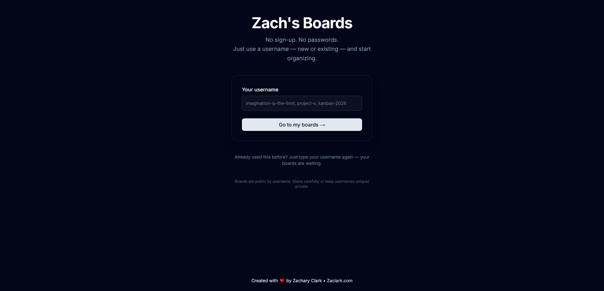
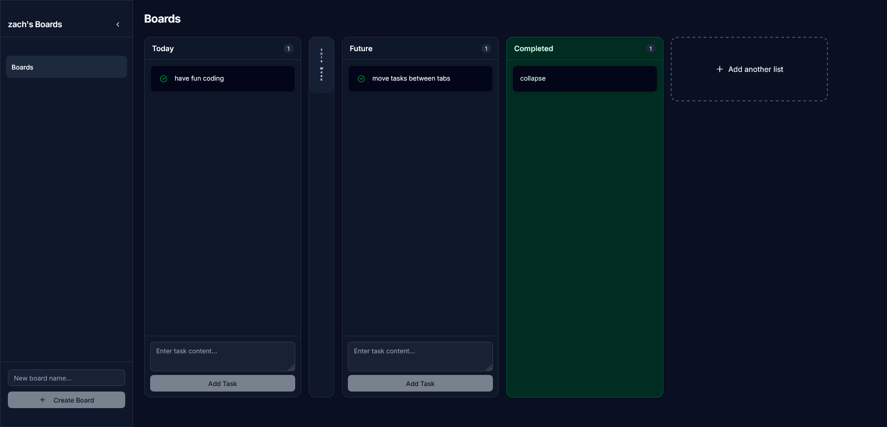

# Kanban Boards – No Login, Just Username

My simple, Trello-inspired Kanban board app where anyone can create and share boards using only a username — no accounts, no passwords.

I built this app because I originally wanted something local to stay on task for projects im making as I'm easily sidetracked.

I decided to just make it free, open source, and simple to use for everyone, have fun making boards, and share them with others.

Public by design: anyone who knows the username can view and edit the boards.

Built with Next.js App Router, Turso (SQLite), Drizzle ORM, shadcn/ui, and dnd-kit (coming soon for drag & drop).

## Kofi Support

If you like what I do, you can support me on [Kofi](https://ko-fi.com/spacedubby07).

## Screenshots

### Home / Username Entry



### Board View (with lists & tasks)



## Features

- No authentication — just pick a username
- Create as many boards as you want per username
- Default lists: Today, This Week, Future, Completed
- Add custom lists
- Add, delete, and mark tasks as complete (moves to Completed list)
- Collapsible lists (vertical pill titles when minimized)
- Protected default lists (cannot delete Today/This Week/Future/Completed)
- Optimistic updates — instant UI feedback on create/delete
- Responsive design
- Turso + Drizzle for lightweight SQLite database (edge-ready)
- shadcn/ui + Tailwind for clean, accessible components

(Drag & drop reordering coming soon)

## Tech Stack

- **Framework**: Next.js 16+ (App Router)
- **Database**: Turso (libSQL / SQLite)
- **ORM**: Drizzle ORM + drizzle-kit
- **UI**: shadcn/ui + Tailwind CSS
- **Icons**: lucide-react
- **Toasts**: sonner
- **Deployment ready**: Vercel (with Turso integration)

## Getting Started

### 1. Clone the repo

```bash
git clone https://github.com/yourusername/kanban-boards.git
cd kanban-boards
```

### 2. Install dependencies

```bash
npm install
```

### 3. Create a `.env.local` file and populate with turso db and auth token

```bash
TURSO_DATABASE_URL=
TURSO_AUTH_TOKEN=
```

### 4. Run the app

```bash
npm run dev
```

### 5. Visit [http://localhost:3000](http://localhost:3000) in your browser.

### 6. To remove dark mode, remove className="dark" from `layout.tsx`

### 7. Have fun, thanks for checking it out!
